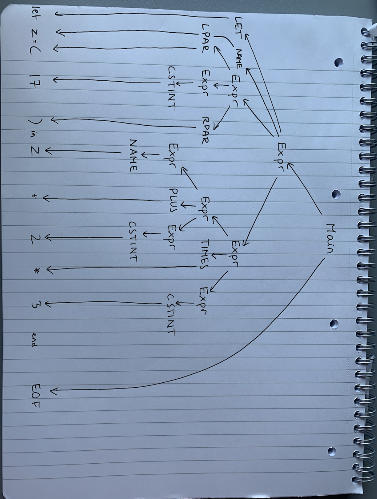

# Assignment 03

### Exercise 3.3

`let z = (17) in z + 2 * 3 end EOF`

&rarr; (**rule A**) Expr EOF \
&rarr; (**rule F**) LET NAME EQ Expr IN Expr END EOF \
&rarr; (**rule G**) LET NAME EQ Expr IN Expr TIMES Expr END EOF \
&rarr; (**rule C**) LET NAME EQ Expr IN Expr TIMES CSTINT(3) END EOF \
&rarr; (**rule H**) LET NAME EQ Expr IN Expr PLUS Expr TIMES CSTINT(3) END EOF \
&rarr; (**rule C**) LET NAME EQ Expr IN Expr PLUS CSTINT(2) TIMES CSTINT(3) END EOF \
&rarr; (**rule B**) LET NAME EQ Expr IN NAME(z) PLUS CSTINT(2) TIMES CSTINT(3) END EOF \
&rarr; (**rule E**) LET NAME EQ LPAR Expr RPAR IN NAME(z) PLUS CSTINT(2) TIMES CSTINT(3) END EOF \
&rarr; (**rule C**) LET NAME EQ LPAR CSTINT(17) RPAR IN NAME(z) PLUS CSTINT(2) TIMES CSTINT(3) END EOF \
&rarr; (**rule B**) `LET NAME`(z) `EQ LPAR CSTINT` (17) `RPAR IN NAME `(z) `PLUS CSTINT `(2) `TIMES CSTINT `(3) `END EOF `

### Exercise 3.4

### Exercise 3.5

open Parse;;

> fromString "1 + 2 _ 3";;
> val it : Absyn.expr = Prim ("+", CstI 1, Prim ("_", CstI 2, CstI 3))

> fromString "1 - 2 - 3";;
> val it : Absyn.expr = Prim ("-", Prim ("-", CstI 1, CstI 2), CstI 3)

> fromString "1 + -2";;
> val it : Absyn.expr = Prim ("+", CstI 1, CstI -2)

> fromString "x++";;
> System.Exception: parse error near line 1, column 3

at Microsoft.FSharp.Core.PrintfModule+PrintFormatToStringThenFail@1433[TResult].Invoke (System.String message) [0x00000] in <b56f33d2f53c2e7533e6754e4d8591b5>:0
at FSI_0002.Parse.fromString (System.String str) [0x0009a] in <6bbfb9fd1c114c28bff331eaaf0c3ab5>:0
at <StartupCode$FSI_0007>.$FSI_0007.main@ () [0x00000] in <6bbfb9fd1c114c28bff331eaaf0c3ab5>:0
at (wrapper managed-to-native) System.Reflection.RuntimeMethodInfo.InternalInvoke(System.Reflection.RuntimeMethodInfo,object,object[],System.Exception&)
at System.Reflection.RuntimeMethodInfo.Invoke (System.Object obj, System.Reflection.BindingFlags invokeAttr, System.Reflection.Binder binder, System.Object[] parameters, System.Globalization.CultureInfo culture) [0x0006a] in <baaab171478d4061bd9316f48a642f06>:0
Stopped due to error

> fromString "x++";;
> System.Exception: parse error near line 1, column 3

at Microsoft.FSharp.Core.PrintfModule+PrintFormatToStringThenFail@1433[TResult].Invoke (System.String message) [0x00000] in <b56f33d2f53c2e7533e6754e4d8591b5>:0
at FSI_0002.Parse.fromString (System.String str) [0x0009a] in <6bbfb9fd1c114c28bff331eaaf0c3ab5>:0
at <StartupCode$FSI_0008>.$FSI_0008.main@ () [0x00000] in <6bbfb9fd1c114c28bff331eaaf0c3ab5>:0
at (wrapper managed-to-native) System.Reflection.RuntimeMethodInfo.InternalInvoke(System.Reflection.RuntimeMethodInfo,object,object[],System.Exception&)
at System.Reflection.RuntimeMethodInfo.Invoke (System.Object obj, System.Reflection.BindingFlags invokeAttr, System.Reflection.Binder binder, System.Object[] parameters, System.Globalization.CultureInfo culture) [0x0006a] in <baaab171478d4061bd9316f48a642f06>:0
Stopped due to error

> fromString "1 + 1.2";;
> System.Exception: Lexer error: illegal symbol near line 1, column 6

at Microsoft.FSharp.Core.PrintfModule+PrintFormatToStringThenFail@1433[TResult].Invoke (System.String message) [0x00000] in <b56f33d2f53c2e7533e6754e4d8591b5>:0
at FSI_0002.Parse.fromString (System.String str) [0x0009a] in <6bbfb9fd1c114c28bff331eaaf0c3ab5>:0
at <StartupCode$FSI_0009>.$FSI_0009.main@ () [0x00000] in <6bbfb9fd1c114c28bff331eaaf0c3ab5>:0
at (wrapper managed-to-native) System.Reflection.RuntimeMethodInfo.InternalInvoke(System.Reflection.RuntimeMethodInfo,object,object[],System.Exception&)
at System.Reflection.RuntimeMethodInfo.Invoke (System.Object obj, System.Reflection.BindingFlags invokeAttr, System.Reflection.Binder binder, System.Object[] parameters, System.Globalization.CultureInfo culture) [0x0006a] in <baaab171478d4061bd9316f48a642f06>:0
Stopped due to error

> fromString "let z = (17) in z + 2 _ 3 end";;
> val it : Absyn.expr =
> Let ("z", CstI 17, Prim ("+", Var "z", Prim ("_", CstI 2, CstI 3)))

### Exercise 3.6

See code in Parse.fs

### Exercise 3.7

See code in Absyn.fs, ExprLex.fsl and ExprPar.fsy
Saved commands:

Navigate into Expr folder \
`./fsharp/fslex --unicode ExprLex.fsl`
`./fsharp/fsyacc --module ExprPar ExprPar.fsy `
`fsharpi -r ./fsharp/FsLexYacc.Runtime.dll Absyn.fs Expr.fs ExprPar.fs ExprLex.fs Parse.fs `
